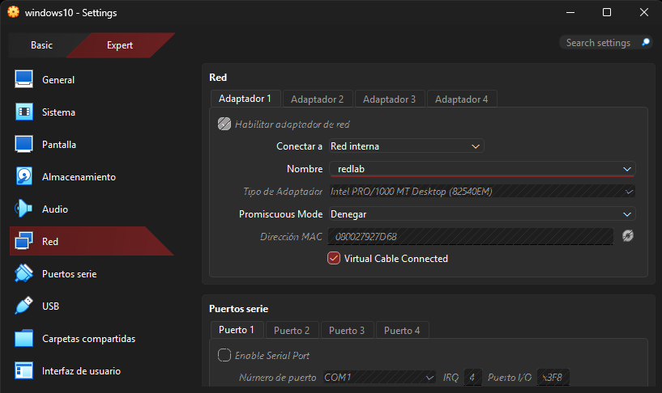

# Introducción al laboratorio Jerale

## Objetivo

Documentar de forma ordenada el proceso de implementación de un laboratorio de Windows Server en VirtualBox, incluyendo la instalación del sistema, la configuración de Active Directory, la incorporación de un cliente al dominio y la revisión de servicios de red y GPO.

## Procedimiento realizado

Se preparó un entorno virtualizado con un servidor Windows Server y un cliente Windows para trabajar con el dominio inacap.local. Se registró la arquitectura básica del laboratorio, los nombres de equipo y la función de cada máquina dentro del escenario.

## Resultado obtenido

Se consolidó una wiki técnica sencilla que permite seguir el laboratorio paso a paso, desde el arranque inicial hasta la configuración de políticas y servicios.

## Evidencia

