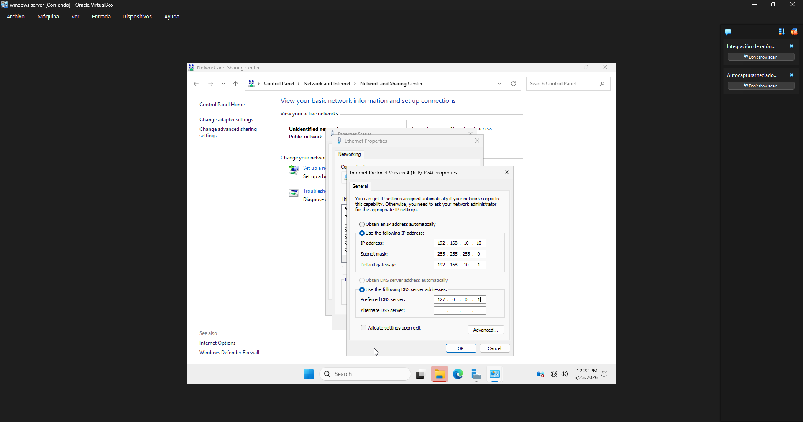

# Instalación de Windows Server

## Objetivo

Instalar Windows Server en VirtualBox y dejarlo listo para ser usado como controlador de dominio.

## Procedimiento realizado

Se creó una máquina virtual en VirtualBox con recursos suficientes para un servidor de dominio. Se instaló Windows Server y se configuró el nombre del equipo como SRV-DC01. Luego se asignó la IP estática 192.168.10.10 y se verificó que el servidor pudiera responder en la red local.

## Resultado obtenido

El servidor quedó operativo con el nombre SRV-DC01 y la dirección IP 192.168.10.10, lista para la instalación del rol de Active Directory.

## Evidencia

