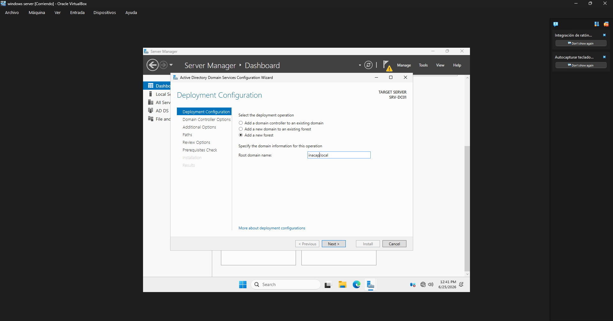

# Configuración de Active Directory

## Objetivo

Instalar y configurar el rol de Active Directory Domain Services en SRV-DC01 para crear el dominio inacap.local y administrar usuarios y equipos de forma centralizada.

## Procedimiento realizado

1. Se accedió al Administrador del servidor en SRV-DC01.
2. Se instaló el rol de Active Directory Domain Services.
3. Se promovió el equipo a controlador de dominio.
4. Se creó el dominio inacap.local.
5. Se verificó que el servicio de dominio estuviera operativo y que el servidor funcionara como controlador principal del laboratorio.

## Resultado obtenido

El servidor SRV-DC01 quedó configurado como controlador de dominio del dominio inacap.local. Esto permitió gestionar usuarios, equipos y servicios desde una única autoridad central.

## Evidencia

