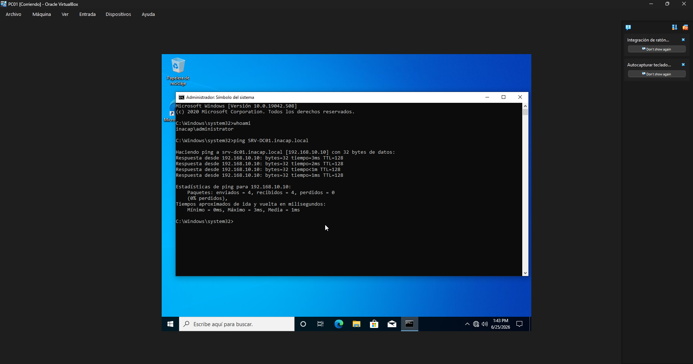

# Integración del cliente al dominio

## Objetivo

Unir un cliente Windows al dominio inacap.local para poder autenticar usuarios desde el controlador.

## Procedimiento realizado

Se creó una máquina cliente llamada PC01 y se dejó que obtuviera su IP por DHCP. Luego se cambió el nombre del equipo y se unió al dominio inacap.local. Se probó el acceso con credenciales del dominio y se verificó la correcta comunicación con SRV-DC01.

## Resultado obtenido

El equipo PC01 quedó unido al dominio y listo para usar recursos compartidos y servicios gestionados por Active Directory.

## Evidencia

