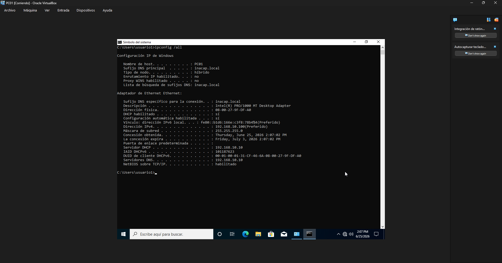

# Servicios de red y comunicación

## Objetivo

Verificar que la red del laboratorio funcione correctamente entre el servidor y el cliente.

## Procedimiento realizado

Se revisó la configuración de red del servidor SRV-DC01 con IP fija 192.168.10.10 y del cliente PC01 con IP obtenida por DHCP. También se comprobó la conectividad mediante ping y la resolución del nombre del dominio y del servidor.

## Resultado obtenido

La comunicación entre el servidor y el cliente quedó estable, lo que permitió continuar con la configuración de servicios y políticas del dominio.

## Evidencia

