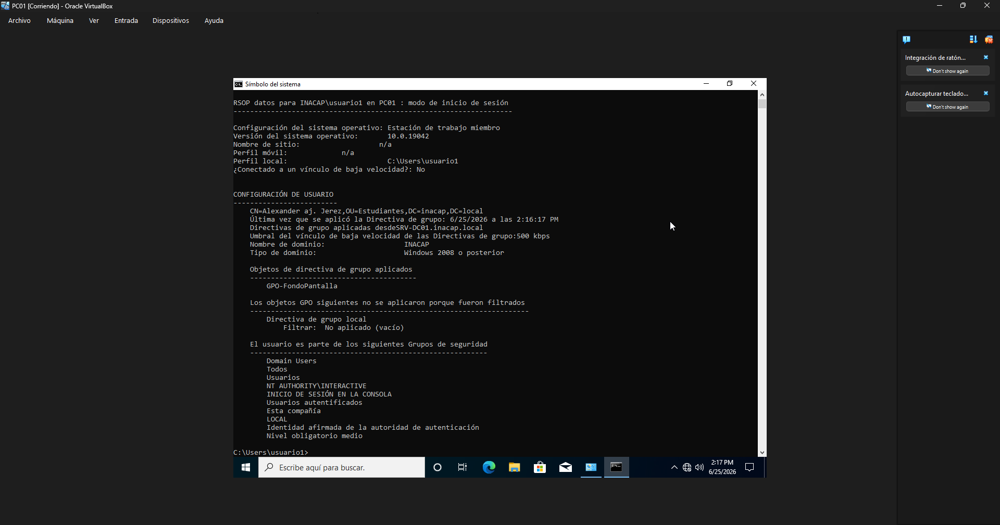

# Gestión de GPO

## Objetivo

Aplicar políticas de grupo básicas sobre los equipos del dominio para reforzar la administración centralizada.

## Procedimiento realizado

Se accedió a la consola de Gestión de Directivas de Grupo desde el controlador de dominio. Se creó una política básica para definir configuraciones de seguridad y comportamiento de inicio de sesión en los equipos del dominio.

## Resultado obtenido

Se obtuvo una primera experiencia práctica con GPO, comprendiendo cómo las políticas se aplican desde Active Directory a los equipos miembros del dominio.

## Evidencia

